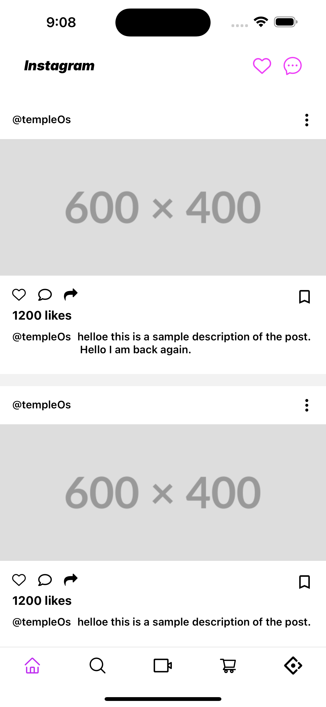

# Instagram Clone 📸

This **Instagram Clone** is a very basic app built using **React Native**. It focuses on setting up navigation and displaying a static home screen similar to Instagram's layout. This is a minimal version with no interactive features implemented yet.

---

## Features ✨
- **Navigation Setup**: Basic navigation has been implemented.
- **Home Screen**: A static UI of the Instagram home feed has been created, showing a simple layout without any interactions.
- Basic structure in place to expand with additional features in the future.

---

## Screenshots 📸

### 1. Home Screen (Static)

---

## How to Run 🏃‍♂️

1. Clone the repository:
    ```bash
    git clone https://github.com/anirudhsingh8/InstagramClone.git
    ```

2. Navigate to the project directory:
    ```bash
    cd InstagramClone
    ```

3. Install dependencies:
    ```bash
    npm install
    ```

4. Run the app on an Android or iOS simulator:
    ```bash
    npm start
    ```

---

## Concepts Used 💡
- **Navigation**: Implemented `react-navigation` to set up basic navigation between screens.
- **Styling**: Used `native-wind` for styling.
- **Static UI**: Designed a basic home screen layout resembling Instagram’s feed but without interactive functionality.
- **React Native Styling**: Used `StyleSheet` for building and arranging static elements on the screen.